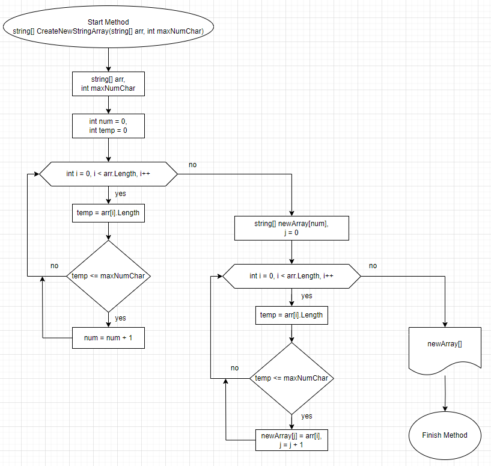

**Задача:** Написать программу, которая из имеющегося массива строк формирует новый массив из строк, длина которых меньше, либо равна 3 символам. Первоначальный массив можно ввести с клавиатуры, либо задать на старте выполнения алгоритма. При решении не рекомендуется пользоваться коллекциями, лучше обойтись исключительно массивами.

**Примеры:**
[“Hello”, “2”, “world”, “:-)”] → [“2”, “:-)”]
[“1234”, “1567”, “-2”, “computer science”] → [“-2”]
[“Russia”, “Denmark”, “Kazan”] → []

---

**Решение:**
1. Получаем от пользователя массив строк с помощью метода *string[] EnterStringArray()* 
2. С помощью метода *EnterStringArray()* получаем значение максимального количества символов в отдельно взятой строке;
3. Для реализации поставленной задачи применяем метод *string[] CreateNewStringArray(string[] arr, int maxNumChar)*, в котором используем свойство string.Length, показывающее количество символов в строке.
4. На вход метода подается массив строк, указанный в пункте 1 и значение максимального количества символов в отдельно взятой строке, указанное в пункте 2.
5. С помощью первого цикла *for* производится подсчет количества строк, удовлетворяющих занному условию максимального количества элементов в ней. По окончании цикла получаем значение *num*. 
6. Следующим этапом создается новый массив строк *string[] newArray = new string[num]*, размерности, указанной в переменной *num*, полученной в пункте 5.
7. С помощью второго цикла *for* происходит заполнение нового массива строк указанного в пункте 6. На каждой инерации осуществляется проверка соблюдения условия максимального количества элементов в строке. 
8. Заполненный массив, указанный у пункте 6, возваращается методом *CreateNewStringArray*.
### Алгоритм метода *CreateNewStringArray* представлен ниже:
 

 9. С помощю метода *void PrintArray(string[] arrayToPrint)*, осуществляется вывод массивов полученных в пунктах 1 и 8 в консоль терминала.

**Реализация решения задачи в директории FinalTasк**

